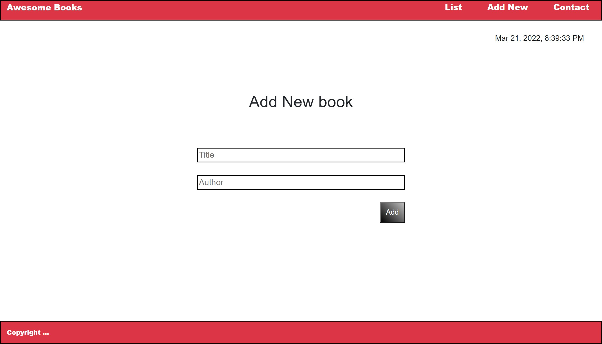

# My-Awesome-books in ES6

My Awesome Books is a basic website that allows users to add/remove books from a list and achieved that by using JavaScript ES6 and used modules in a single JS file.

## Built With

- HTML & CSS
- linters
- JavaScript

## Live Demo
[Live Demo Link]( https://monika-soam.github.io/Awesome-Books-ES6/)

## ScreenShot Demo

Getting Started
To get the content of this project locally you need to run this command in your terminal:

[My Awesome Books](https://github.com/monika-soam/My-Awesome-books)
Test For tracking linter errors locally you need to follow these steps:

After cloning the project you need to run this command

`npm install` This command will download all the dependancies of the project

For tracking the linter errors in HTML file run:

`npx hint .`

For tracking the linter errors in CSS file run:

`npx stylelint "\*_/_.{css,scss}"`

And For tracking the linter errors in JavaScript file run:

`npx eslint .`

 

👤 **Monika**

- GitHub: [GitHub](https://github.com/monika-soam)
- Twitter: @monikasoam
- LinkedIn: [LinkedIn](linkedin.com/in/monika-soam-✓-16b59925)

🤝 **Contributing**

Contributions, issues, and feature requests are welcome!

Feel free to check the [issues page](https://github.com/monika-soam/My-Awesome-books/issues).

## Show your support

Give a ⭐️ if you like this project! and advice me where to work upon it

## 📝 License

This project is [MIT](./MIT.md) licensed.

